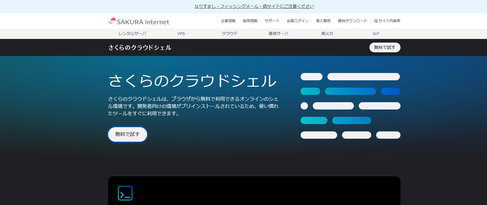
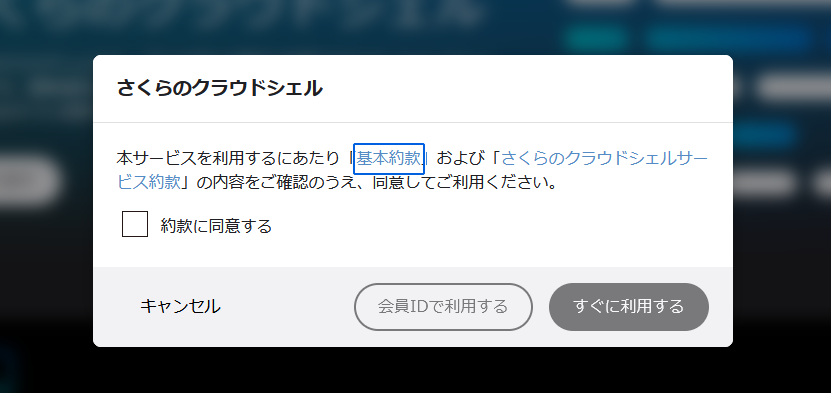

# 01 ビルドができない

cat <<"EOF" | sudo -u user tee /home/user/app/README 1>/dev/null 2>&1
以下のコマンドでクロスコンパイルをしようとしたところ失敗してしまいました。なぜでしょうか。
また、ビルドするためにはどうすればよいか答えてください。

```
GOOS=linux GOARCH=arm64 go build
```

## 初期状態

- ビルドができない

## 終了状態

- ビルドができる
- 以下のコマンドで`hello world`が出力される

```
qemu-aarch64-static ./app
```

## 環境構築

OS: Ubuntu

`setup.sh`を実行するとパッケージのインストールとユーザーの追加・各種設定を行います。

```bash
curl https://raw.githubusercontent.com/ophum/prob/main/01/setup.sh | sudo sh
```

### さくらのクラウドシェルを使う

さくらの会員に登録する必要があります。

https://www.sakura.ad.jp/services/cloudshell/

「無料で試す」を押下する。



「約款に同意する」にチェックを入れて「会員IDで利用する」を押下する。



環境構築のスクリプトを実行する


